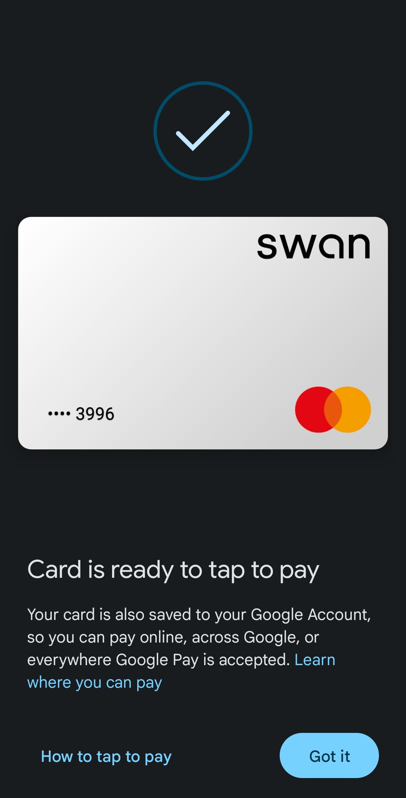

# Context

While working at Swan, one of my first task was to make it so that we can add our cards into Apple and Google Wallet.
This was the all the information I was given to start with and started a Journey that would allow me to understand what it means to pay with my phone.
If you'd like to know more, I'll soon write an article about how it work in details.

# The team

We started this project when the company had reached ten employees.
This mean that for this project, I acted as Product Manager, Product Designer, Mobile Engineer, Backend Engineer and managed the communication with the different partners (Google, Apple, Mastercard)

After a while, I got to onboard a new PM and a new Dev to the team to finish the project and share it's knowledge

# The work

A summary of the work needed for this project can be:

- Understand what needs to be done (Google and Apple have their own specific requirements into what we have to follow)
- Interact with Google, Apple and Mastercard (both to obtain all the necessary access but also to clarify the production requirements)
- Design a solution that allows us to respect the requirements
- Implement the solution
  - Create the API necessary for tokenization and In App Provisioning
  - Implement InApp Provisioning in Android and IOS
- Secure the certification by external third party
- Enjoy!

# The result

